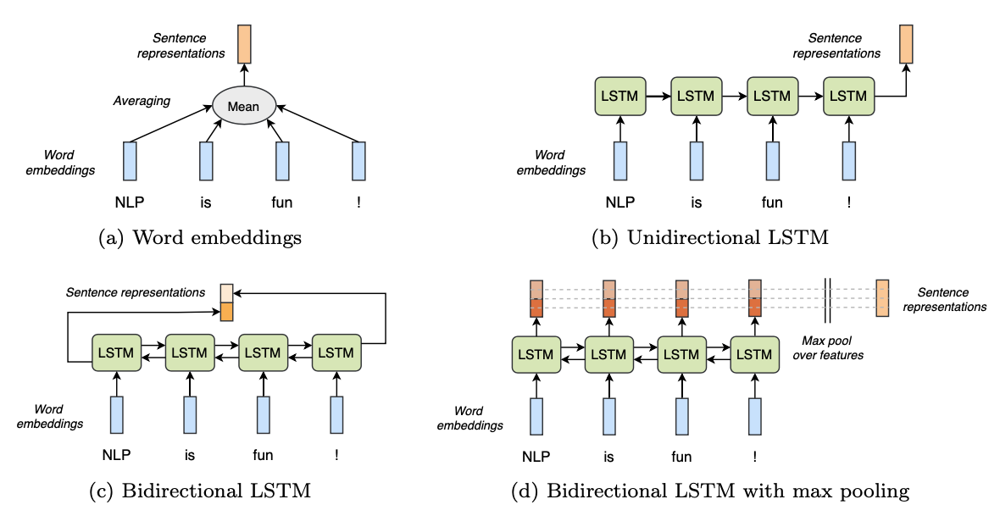

# Sentence Representation via Natural Language Inference

This repo implements some models from the paper "Supervised Learning of Universal Sentence Representations from Natural Language Inference Data" by A. Conneau et al., and replicates some of its experiments.

In particular, the we implement:
- an Average Word Embedding (AWE) model using GloVe embeddings,
- a unidirectional LSTM (LSTM) model,
- a bidirection LSTM (BiLSTM) model, and
- a bidirectional LSTM model with max pooling (BiLSTM-MaxPool) over the sequence dimension.

An overview of the 4 models is provided below:


The code consists of 4 folders and 4 python files:

- `data/` contains the train/dev/test splits of the SNLI dataset, it's pickled vocabulary and the GloVe embeddings that result from it
- `pretrained/` contains the checkpoint of trained models
- `senteval/` contains the pickled results of the four models implemented when evaluated on the SentEval toolkit from Facebook AI Research
- `tb_logs/` contains tensorboard logs from the training and testing on SNLI

- `data.py` implements a Pytorch Lightning Datamodule for the SNLI dataset.
- `eval.py` is a script that evaluates the implemented models on SentEval.
- `model.py` implements the 4 models as PyTorch modules, and also implements a Pytorch Lightning to handle the training
- `train.py` is a script that trains the models on SNLI and produces the tensorboard logs

In additions to these files, this repo also includes 2 yaml files containing a conda environment for CPU and GPU, and a demo IPython Notebook to showcase the results and how to use the provided code.

The 4 folders are currently empty, but you can download their contents (~1 GB unzipped) from [Google Drive](https://drive.google.com/file/d/14KO7UUSeYq1hyQc8GUhXS8ElQUKKQH1-/view?usp=sharing). If you prefer to train from scrach on the other hand, you can run

```
# Train & evaluate on SNLI
python train.py [-h] [--data_dir DATA_DIR] [--encoder {AWE,LSTM,BiLSTM,BiLSTM-MaxPool}] [--lstm_hidden_dim LSTM_HIDDEN_DIM] [--batch_size BATCH_SIZE] [--num_epochs NUM_EPOCHS]

# Evaluate on SentEval
eval.py [-h] [--encoder ENCODER]
```

In any case, be sure to install the appropriate conda environment, so that you have all the libraries needed.